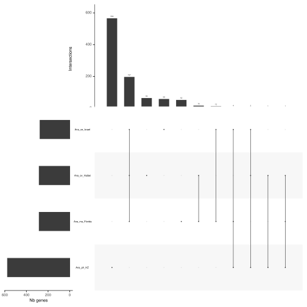

# PanExplorer

Web application to explore bacterial pangenomes

**Homepage:**: [https://panexplorer.southgreen.fr](https://panexplorer.southgreen.fr)

Dependencies:
- singularity
- java

## Introduction

PanExplorer performs pan-genome analysis (using PGAP or Roary) and exposes resulting information as a comprehensive and easy way, through several modules facilitating the exploration gene clusters and interpretation of data.

The application allows interactive data exploration at different levels :

(i) Pan-genome visualization as a presence/absence heatmap. This overview allows to easily identify and distinguish core-genes (present in all strains), cloud genes (genes from the accessory genome) and genome-specific genes.

(ii) Physical map of core-genes and strain-specific genes can be displayed as a circular genomic representation (Circos), for each genome taken independently.

(iii) Synteny analysis. The conservation of gene order between genomes can be investigated using graphical representations.

(iv) Visual inspection of a specific cluster.


## Citation

[https://doi.org/10.1093/bioinformatics/btac504](https://doi.org/10.1093/bioinformatics/btac504)

## Authors

* Alexis Dereeper (IRD)
* Damien Meyer (Cirad)


## Install

1- Git clone

```
git clone https://github.com/SouthGreenPlatform/PanExplorer.git
cd PanExplorer
```

2- Get the singularity container

```
cd singularity
wget https://panexplorer.southgreen.fr/singularity/panexplorer.sif
```

## Run the workflow as command line

1- Define the PANEX_PATH environnement variable

```
export PANEX_PATH=/usr/local/bin/PanExplorer_workflow
```

2- Prepare your input dataset (list of genomes to be analyzed)

Edit a new file names "genbank_ids" listing the Genbank identifiers of complete assembled and annotated genomes. 

The file should look like this

```
cat genbank_ids
CP000235.1
CP001079.1
CP001759.1
CP015994.2
```

3- Run the workflow

This step assumes you have singularity installed.

If singularity is not installed, have a look first to this: https://singularity-tutorial.github.io/01-installation/

Creating a pangenome using Roary

```
singularity exec PanExplorer/singularity/panexplorer.sif snakemake --cores 1 -s $PANEX_PATH/Snakemake_files/Snakefile_wget_roary_heatmap_upset_COG
```

Creating a pangenome using PGAP

```
singularity exec PanExplorer/singularity/panexplorer.sif snakemake --cores 1 -s $PANEX_PATH/Snakemake_files/Snakefile_wget_PGAP_heatmap_upset_COG
```

In both cases, you should a new directory named "outputs" containing all output files.

This includes:

UpsetR Diagram

 
 
 Presence/absence heatmap of accessory genes:
 
 

## Deploy the Web application

This section describes how to deploy the web application on a Ubuntu running with Apache2.

As an example, we assume that files will be placed as follows in the following folder /var/www

1- Copy your panexplorer folder into /var/www

```
sudo mkdir /var/www/panexplorer
sudo cp -rf PanExplorer/* /var/www/panexplorer
```

2- Configure Apache

In ubuntu, the CGI module must be first enabled using this command

```
sudo a2enmod cgid
```

Add the following lines in the Apache configuration file /etc/apache2/apache2.conf or create a new VirtualHost containinf the following lines

```
        DocumentRoot /var/www/panexplorer/htdocs
        Alias   /panexplorer /var/www/panexplorer/htdocs

        <Directory "/var/www/panexplorer/htdocs/">
                AllowOverride All
                Options +FollowSymLinks +Indexes
                Require all granted
        </Directory>

        LoadModule cgid_module modules/mod_cgid.so

        ScriptAlias /cgi-bin/ /var/www/panexplorer/cgi-bin/

        <Directory "/var/www/panexplorer/cgi-bin/">

                Options +Indexes +FollowSymLinks +MultiViews +Includes +ExecCGI
                AllowOverride All
                SetHandler cgi-script
                Require all granted
        </Directory>
        
```

Restart apache

```
systemctl restart apache2
```

3- Install Perl modules

```
sudo perl -MCPAN -e shell

>install CGI::Session
>install MIME::Lite

```

4- Copy directories into dedicated HTML and CGI directories

```
sudo chown -R www-data /var/www/panexplorer/*
sudo chmod -R 755 /var/www/panexplorer/*
```

```
sudo chown -R www-data /var/www/panexplorer/cgi-bin/*
sudo chmod -R 755 /var/www/panexplorer/cgi-bin/*
```

Create a directory for storing temporary outputs

```
sudo mkdir /var/www/panexplorer/htdocs/tmp
sudo chown -R www-data /var/www/panexplorer/htdocs/tmp
```

5- Edit the Configuration file and javascript

```
sudo vi /var/www/panexplorer/cgi-bin/Config/Configuration.pm
```

Modify the following lines depending on your environnement

```
our $HOMEPAGE = "http://localhost/panexplorer";
our $WEB_DIR = "http://localhost/panexplorer";
our $HOME_DIR = "/var/www/panexplorer/htdocs/";
our $CGI_DIR = "/var/www/panexplorer/cgi-bin/";
our $CGI_WEB_DIR    = "http://localhost/cgi-bin";
our $TEMP_EXECUTION_DIR = "/var/www/panexplorer/htdocs/tmp";
```

6- Get up-to-date genomes available at genbank

```
wget https://ftp.ncbi.nlm.nih.gov/genomes/GENOME_REPORTS/prokaryotes.txt
sudo cp -rf prokaryotes.txt /var/www/panexplorer/cgi-bin/data/
```

7- Access to your application using the URL defined in Configuration.pm

http://localhost/cgi-bin/home.cgi

## License

Licencied under `CeCill-C <http://www.cecill.info/licences/Licence_CeCILL-C_V1-en.html>`_ and GPLv3.
